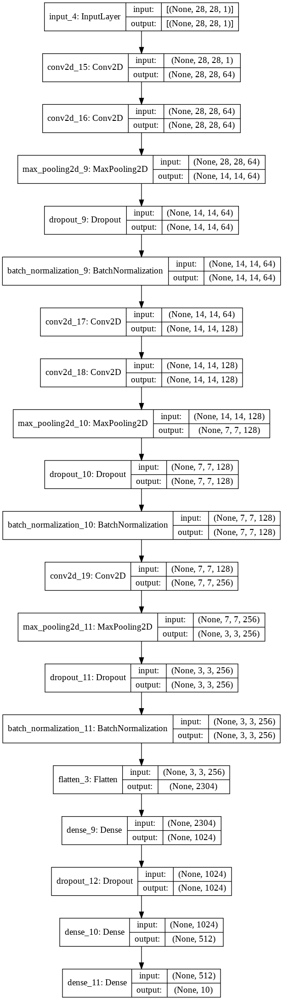
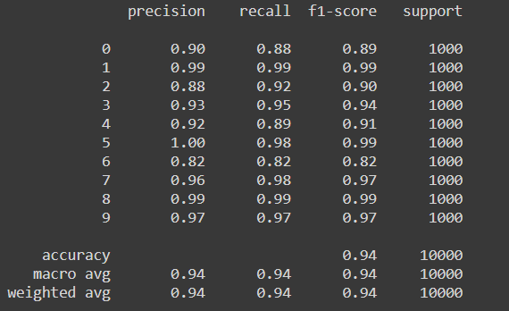
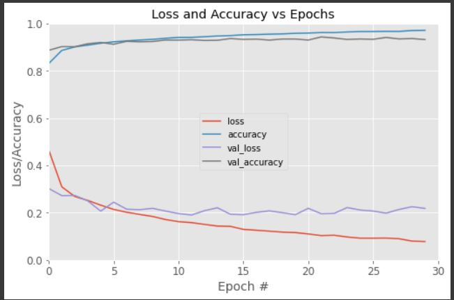

# Fashion-MNIST-Classification   
This repo contains the famous Fashion MNIST Image Classification task which gives approx 94% Test Accuracy **without using Transfer Learning.**

## Datasets 
Dataset is already available inside the keras library. You can load the data using `keras.datasets.fashion_mnist.load_data()`. Read more about the Datasets [here](https://www.kaggle.com/zalando-research/fashionmnist)

### Data Preprocessing
As Keras provides us the almost processed Fashion MNIST data, I have just scaled down the images and bring down the pixel range in between 0 to 1 by dividing the each image array by 255. and add 1 more axis (channel axis i.e. 1).

## Model Architecture
I have used several Conv2D, Max Pooling, Batch Normalization, Dropout and Dense layers. Refer the following model architecture:  

### Hyperparameters  

Following is the Hyperparameters values which I have used in this porject.  

Name | Value
-----|------
Learning Rate | 0.0001
Epochs | 30
Batch Size | 32
Optimizer | Adam
Activation Function | Relu(Hidden layers) and Softmax(Last layer)
Loss Function | Sparse Categorical Cross Entropy

## Results and Evaluation

### Classification Report
Classfiction Report for this project is as follows: 

### Loss/Accuracy vs Epochs Plot

  

I have got **93.81%** Testing Accuracy and 93.81% F1-score.

## Future Scope
- Improve the results by using Transfer Learning model like VGGNet, ResNet, etc.
